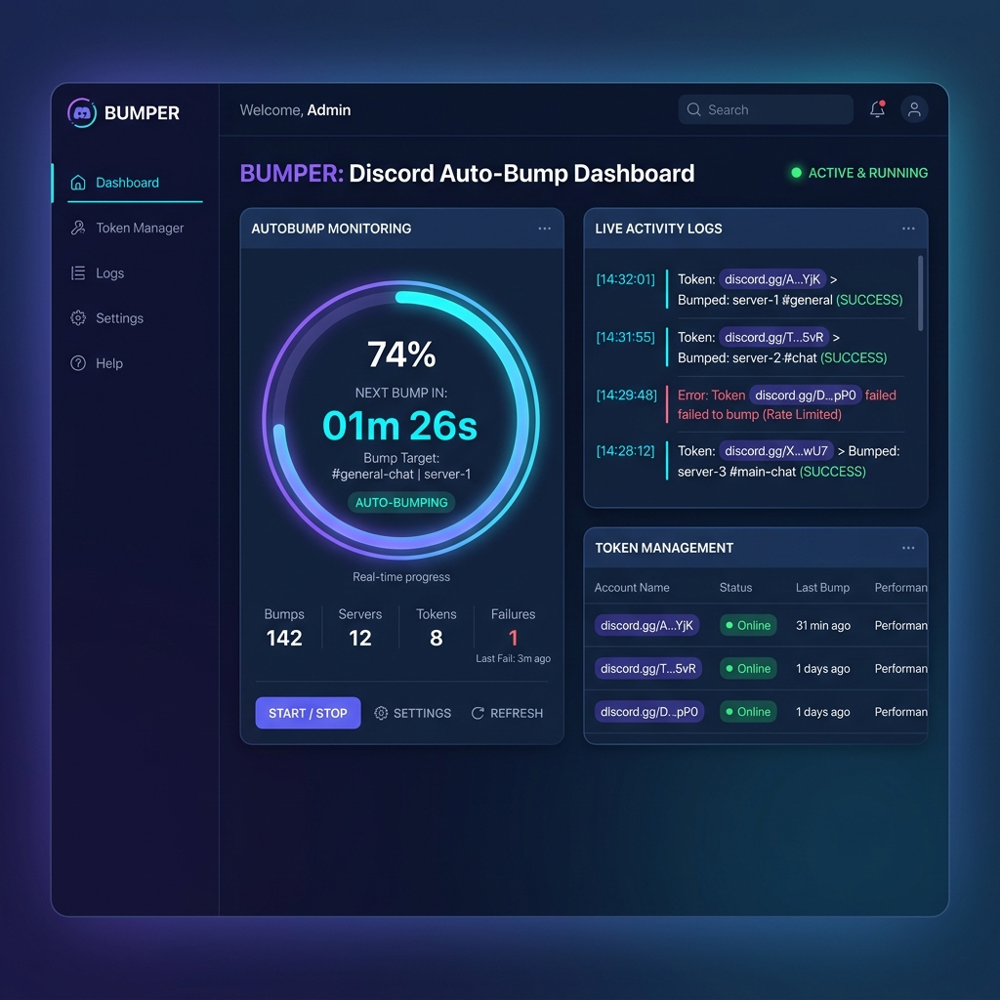

# 🤖 BUMPER — Discord Auto-Bumper & Management Platform

[](https://bumper-bot.vercel.app)
[](https://python.org)
[](https://discord.com)

Discord sunucularını ve kanallarını belirlenen zaman aralıklarında otomatik olarak öne çıkaran (`/bump`), geri sayım sayacı, maskeli token yönetimi ve canlı aktivite günlükleri sunan **Glassmorphism Web UI** ve Python tabanlı yönetim platformu.

<p align="center">
  
</p>

---

## 🌟 Öne Çıkan Özellikler

- 🟣 **Discord Glassmorphism Arayüzü:** Blurple (`#5865f2`) ve neon siyan vurguları, Google Fonts (`Inter` & `Outfit`) ve canlı simgeler.
- ⏱️ **Dairesel Geri Sayım Sayacı (Countdown Circle):** Bir sonraki otomatik bump süresine kalan dakikayı/saniyeyi canlı yüzdelik çember ile takip edin.
- 🚀 **Tek Tıkla Manüel Bump (Bump Now):** Zamanlayıcıyı beklemeden istediğiniz an tek tıkla `/bump` işlemini tetikleyin.
- 🔒 **Güvenli Token & Hesap Yönetimi:** Hesabınızın token detaylarını maskelenmiş (`MTI0...****`) olarak saklar, aktif/pasif durumunu anlık izler.
- 📜 **Canlı Aktivite Günlükleri (Live Logs Feed):** Zaman damgalı, renk kodlu (BAŞARILI, RATE_LIMITED) canlı bump raporları.
- 🌐 **Vercel Canlı Demosu:** Herhangi bir kurulum yapmadan Vercel üzerinde anında test edilebilir interaktif demo modu.

---

## 🚀 Hızlı Başlangıç & Kullanım

### 1. Yerel Olarak Çalıştırma (Web GUI)

```bash
# Repozitörü klonlayın
git clone https://github.com/1337om3r/bumper.git
cd bumper

# Web GUI'yi başlatın (Otomatik tarayıcınızı açar)
python3 gui_main.py
```

Arayüz varsayılan olarak **`http://localhost:8085`** adresinde açılacaktır.

---

## 🛠️ Teknolojiler

- **Backend:** Python 3.9+, HTTP Server & SSE Stream Engine
- **Frontend:** HTML5, Modern CSS3 (Glassmorphism, CSS Variables), JavaScript (ES6+), Lucide Icons
- **Deployment:** Vercel Serverless Functions (`api/index.py`), `vercel.json`

---

## 📄 Lisans

Bu proje MIT lisansı altında korunmaktadır. 
Özgürce kullanabilir ve geliştirebilirsiniz!

Made with ❤️ by [1337om3r](https://github.com/1337om3r)
